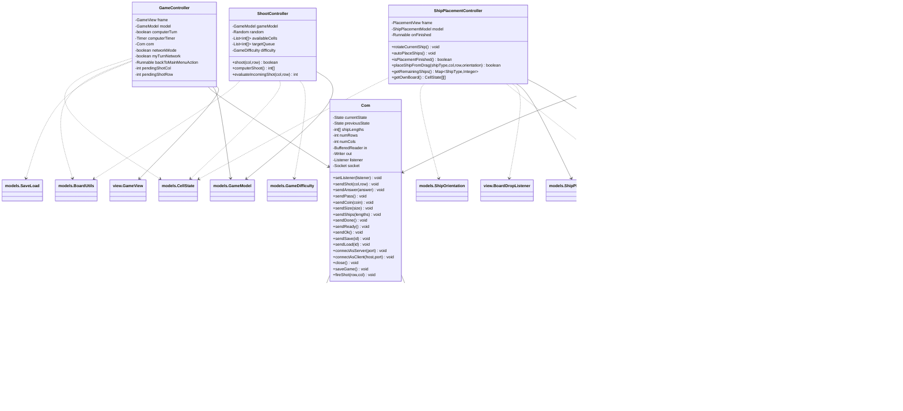

# Controller Diagram

```mermaid
classDiagram
direction TB

class GameView["view.GameView"]
class ConnectionView["view.ConnectionView"]
class PlacementView["view.PlacementView"]
class BoardDropListener["view.BoardDropListener"]
class GameModel["models.GameModel"]
class SaveLoad["models.SaveLoad"]
class BoardUtils["models.BoardUtils"]
class CellState["models.CellState"]
class ShipType["models.ShipType"]
class ShipOrientation["models.ShipOrientation"]
class ShipPlacementModel["models.ShipPlacementModel"]
class GameDifficulty["models.GameDifficulty"]

class Com {
  -State currentState
  -State previousState
  -int[] shipLengths
  -int numRows
  -int numCols
  -BufferedReader in
  -Writer out
  -Listener listener
  -Socket socket
  +setListener(listener) void
  +sendShot(col,row) void
  +sendAnswer(answer) void
  +sendPass() void
  +sendCoin(coin) void
  +sendSize(size) void
  +sendShips(lengths) void
  +sendDone() void
  +sendReady() void
  +sendOk() void
  +sendSave(id) void
  +sendLoad(id) void
  +connectAsServer(port) void
  +connectAsClient(host,port) void
  +close() void
  +saveGame() void
  +fireShot(row,col) void
}

class Listener["Com.Listener"]
<<interface>> Listener
Listener : +onCoin(coin) void
Listener : +onSize(rows,cols) void
Listener : +onShips(lengths) void
Listener : +onDone() void
Listener : +onReady() void
Listener : +onShot(col,row) void
Listener : +onAnswer(answer) void
Listener : +onPass() void
Listener : +onSave(id) void
Listener : +onLoad(id) void
Listener : +onOk() void
Listener : +onConnected() void
Listener : +onDisconnected() void

class State["Com.State"]
<<enumeration>> State
State : START
State : WAITING_FOR_SIZE_DONE
State : WAITING_DONE_SHIPS
State : WAITING_READY
State : MY_TURN
State : ENEMY_TURN
State : WAITING_PASS
State : WAITING_ANSWER
State : WAITING_OK_SAVE
State : WAITING_OK_LOAD
State : GAME_OVER

class GameController {
  -GameView frame
  -GameModel model
  -boolean computerTurn
  -Timer computerTimer
  -Com com
  -boolean networkMode
  -boolean myTurnNetwork
  -Runnable backToMainMenuAction
  -int pendingShotCol
  -int pendingShotRow
}

class NetworkHandshakeController {
  <<utility>>
  +startHost(frame, port, callback) void
  +startClient(frame, host, port, callback) void
}

class ReadyCallback["NetworkHandshakeController.ReadyCallback"]
<<interface>> ReadyCallback
ReadyCallback : +onReady(com, iStart) void
ReadyCallback : +onError(message, e) void

class ShipPlacementController {
  -PlacementView frame
  -ShipPlacementModel model
  -Runnable onFinished
  +rotateCurrentShip() void
  +autoPlaceShips() void
  +isPlacementFinished() boolean
  +placeShipFromDrag(shipType,col,row,orientation) boolean
  +getRemainingShips() Map~ShipType,Integer~
  +getOwnBoard() CellState[][]
}

class ShootController {
  -GameModel gameModel
  -Random random
  -List~int[]~ availableCells
  -List~int[]~ targetQueue
  -GameDifficulty difficulty
  +shoot(col,row) boolean
  +computerShoot() int[]
  +evaluateIncomingShot(col,row) int
}

Com --> Listener
Com --> State

GameController --> GameView
GameController --> GameModel
GameController --> Com
GameController ..> SaveLoad
GameController ..> BoardUtils
GameController ..> CellState

NetworkHandshakeController --> ConnectionView
NetworkHandshakeController --> ReadyCallback
NetworkHandshakeController --> Com
NetworkHandshakeController ..> ShipType

ShipPlacementController --> PlacementView
ShipPlacementController --> ShipPlacementModel
ShipPlacementController ..> BoardDropListener
ShipPlacementController ..> ShipType
ShipPlacementController ..> ShipOrientation
ShipPlacementController ..> CellState

ShootController --> GameModel
ShootController ..> GameDifficulty
ShootController ..> CellState
ShootController ..> BoardUtils
```
