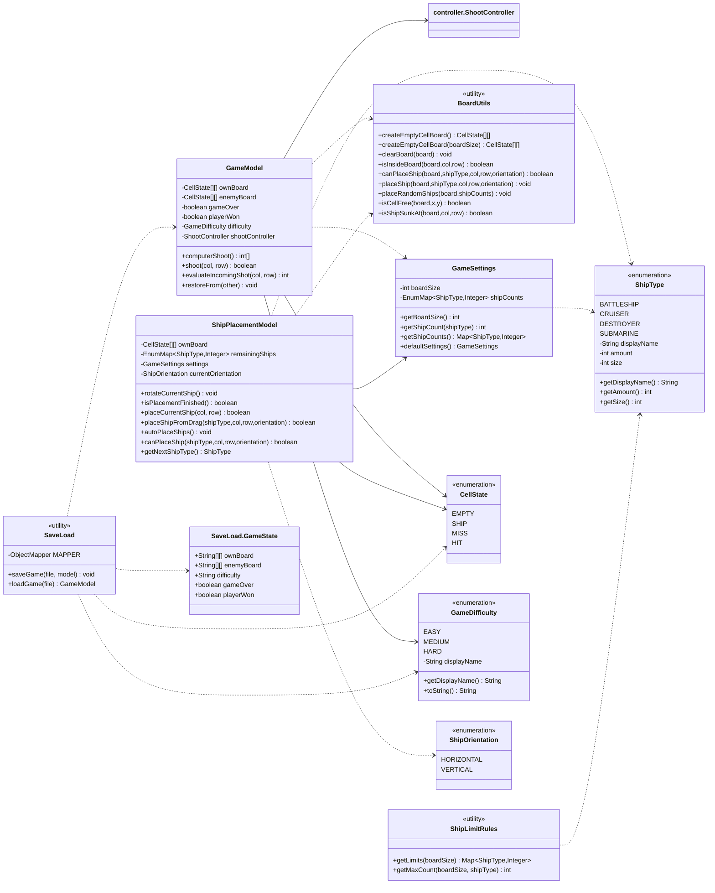

# Model Diagram

```mermaid
classDiagram
direction LR

class ShootController["controller.ShootController"]

class GameModel {
  -CellState[][] ownBoard
  -CellState[][] enemyBoard
  -boolean gameOver
  -boolean playerWon
  -GameDifficulty difficulty
  -ShootController shootController
  +computerShoot() int[]
  +shoot(col, row) boolean
  +evaluateIncomingShot(col, row) int
  +restoreFrom(other) void
}

class GameSettings {
  -int boardSize
  -EnumMap~ShipType,Integer~ shipCounts
  +getBoardSize() int
  +getShipCount(shipType) int
  +getShipCounts() Map~ShipType,Integer~
  +defaultSettings() GameSettings
}

class ShipPlacementModel {
  -CellState[][] ownBoard
  -EnumMap~ShipType,Integer~ remainingShips
  -GameSettings settings
  -ShipOrientation currentOrientation
  +rotateCurrentShip() void
  +isPlacementFinished() boolean
  +placeCurrentShip(col, row) boolean
  +placeShipFromDrag(shipType,col,row,orientation) boolean
  +autoPlaceShips() void
  +canPlaceShip(shipType,col,row,orientation) boolean
  +getNextShipType() ShipType
}

class BoardUtils {
  <<utility>>
  +createEmptyCellBoard() CellState[][]
  +createEmptyCellBoard(boardSize) CellState[][]
  +clearBoard(board) void
  +isInsideBoard(board,col,row) boolean
  +canPlaceShip(board,shipType,col,row,orientation) boolean
  +placeShip(board,shipType,col,row,orientation) void
  +placeRandomShips(board,shipCounts) void
  +isCellFree(board,x,y) boolean
  +isShipSunkAt(board,col,row) boolean
}

class SaveLoad {
  <<utility>>
  -ObjectMapper MAPPER
  +saveGame(file, model) void
  +loadGame(file) GameModel
}

class GameState["SaveLoad.GameState"]
GameState : +String[][] ownBoard
GameState : +String[][] enemyBoard
GameState : +String difficulty
GameState : +boolean gameOver
GameState : +boolean playerWon

class ShipLimitRules {
  <<utility>>
  +getLimits(boardSize) Map~ShipType,Integer~
  +getMaxCount(boardSize, shipType) int
}

class ShipType {
  <<enumeration>>
  BATTLESHIP
  CRUISER
  DESTROYER
  SUBMARINE
  -String displayName
  -int amount
  -int size
  +getDisplayName() String
  +getAmount() int
  +getSize() int
}

class CellState {
  <<enumeration>>
  EMPTY
  SHIP
  MISS
  HIT
}

class GameDifficulty {
  <<enumeration>>
  EASY
  MEDIUM
  HARD
  -String displayName
  +getDisplayName() String
  +toString() String
}

class ShipOrientation {
  <<enumeration>>
  HORIZONTAL
  VERTICAL
}

GameModel --> CellState
GameModel --> GameDifficulty
GameModel ..> GameSettings
GameModel --> ShootController
GameModel ..> BoardUtils

ShipPlacementModel --> CellState
ShipPlacementModel ..> ShipType
ShipPlacementModel ..> ShipOrientation
ShipPlacementModel --> GameSettings
ShipPlacementModel ..> BoardUtils

GameSettings ..> ShipType
ShipLimitRules ..> ShipType

SaveLoad ..> GameModel
SaveLoad ..> GameState
SaveLoad ..> CellState
SaveLoad ..> GameDifficulty
```
