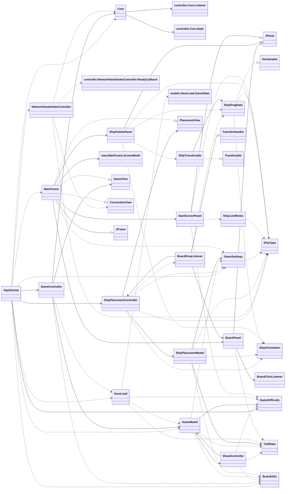

# Overview Diagram

```mermaid
classDiagram
direction LR

class AppStartup
class Com
class ComListener["controller.Com.Listener"]
class ComState["controller.Com.State"]
class GameController
class NetworkHandshakeController
class ReadyCallback["controller.NetworkHandshakeController.ReadyCallback"]
class ShipPlacementController
class ShootController

class GameModel
class GameSettings
class ShipPlacementModel
class BoardUtils
class SaveLoad
class GameState["models.SaveLoad.GameState"]
class ShipLimitRules
class ShipType
class CellState
class GameDifficulty
class ShipOrientation

class MainFrame
class ScreenMode["view.MainFrame.ScreenMode"]
class BoardPanel
class BoardDropListener
class BoardClickListener
class GameView
class PlacementView
class ConnectionView
class ShipDragData
class ShipTransferable
class ShipPalettePanel
class StartScreenPanel
class JFrame
class JPanel
class TransferHandler
class Transferable
class Serializable

AppStartup ..> MainFrame
AppStartup --> GameController
AppStartup --> ShipPlacementController
AppStartup ..> NetworkHandshakeController
AppStartup ..> GameModel
AppStartup ..> GameSettings
AppStartup --> GameDifficulty
AppStartup ..> Com
AppStartup ..> SaveLoad
AppStartup ..> BoardUtils

GameController --> GameView
GameController --> GameModel
GameController --> Com
GameController ..> SaveLoad
GameController ..> BoardUtils

ShipPlacementController --> PlacementView
ShipPlacementController --> ShipPlacementModel
ShipPlacementController ..> BoardDropListener
ShipPlacementController ..> ShipType
ShipPlacementController ..> ShipOrientation
ShipPlacementController ..> GameSettings

NetworkHandshakeController ..> ConnectionView
NetworkHandshakeController ..> Com
NetworkHandshakeController ..> ReadyCallback
NetworkHandshakeController ..> ShipType

Com --> ComListener
Com --> ComState

ShootController --> GameModel
ShootController ..> GameDifficulty
ShootController ..> BoardUtils
ShootController ..> CellState

GameModel --> ShootController
GameModel --> GameDifficulty
GameModel ..> CellState
GameModel ..> GameSettings
GameModel ..> BoardUtils

ShipPlacementModel --> GameSettings
ShipPlacementModel ..> ShipType
ShipPlacementModel ..> ShipOrientation
ShipPlacementModel --> CellState
ShipPlacementModel ..> BoardUtils

GameSettings ..> ShipType
ShipLimitRules ..> ShipType
SaveLoad ..> GameModel
SaveLoad ..> GameState
SaveLoad ..> CellState
SaveLoad ..> GameDifficulty

MainFrame --|> JFrame
MainFrame ..|> GameView
MainFrame ..|> PlacementView
MainFrame ..|> ConnectionView
MainFrame --> StartScreenPanel
MainFrame --> ShipPalettePanel
MainFrame --> BoardPanel
MainFrame --> ScreenMode
MainFrame ..> GameSettings

BoardPanel --|> JPanel
BoardPanel --> BoardClickListener
BoardPanel ..> CellState

BoardDropListener --|> TransferHandler
BoardDropListener --> BoardPanel
BoardDropListener --> ShipPlacementController
BoardDropListener ..> ShipDragData

ShipPalettePanel --|> JPanel
ShipPalettePanel ..> ShipType
ShipPalettePanel ..> ShipOrientation
ShipPalettePanel ..> ShipTransferable
ShipPalettePanel ..> ShipDragData

ShipTransferable ..|> Transferable
ShipTransferable --> ShipDragData

ShipDragData ..|> Serializable
ShipDragData ..> ShipType
ShipDragData ..> ShipOrientation

StartScreenPanel --|> JPanel
StartScreenPanel ..> GameDifficulty
StartScreenPanel ..> ShipLimitRules
StartScreenPanel ..> ShipType
```
