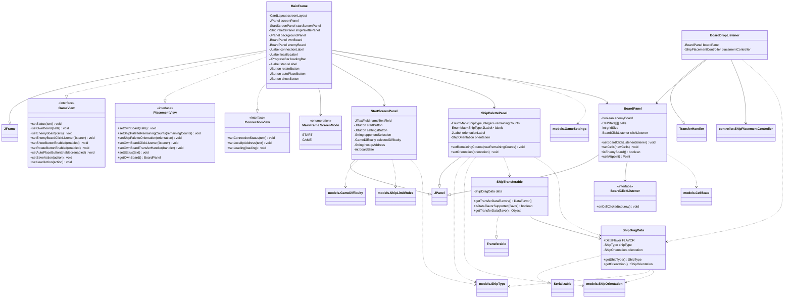

# View Diagram

```mermaid
classDiagram
direction TB

class JFrame
class JPanel
class TransferHandler
class Transferable
class Serializable
class GameSettings["models.GameSettings"]
class CellState["models.CellState"]
class ShipPlacementController["controller.ShipPlacementController"]
class ShipType["models.ShipType"]
class ShipOrientation["models.ShipOrientation"]
class GameDifficulty["models.GameDifficulty"]
class ShipLimitRules["models.ShipLimitRules"]

class GameView {
  <<interface>>
  +setStatus(text) void
  +setOwnBoard(cells) void
  +setEnemyBoard(cells) void
  +setEnemyBoardClickListener(listener) void
  +setShootButtonEnabled(enabled) void
  +setRotateButtonEnabled(enabled) void
  +setAutoPlaceButtonEnabled(enabled) void
  +setSaveAction(action) void
  +setLoadAction(action) void
}

class PlacementView {
  <<interface>>
  +setOwnBoard(cells) void
  +setShipPaletteRemainingCounts(remainingCounts) void
  +setShipPaletteOrientation(orientation) void
  +setOwnBoardClickListener(listener) void
  +setOwnBoardTransferHandler(handler) void
  +setStatus(text) void
  +getOwnBoard() BoardPanel
}

class ConnectionView {
  <<interface>>
  +setConnectionStatus(text) void
  +setLocalIpAddress(text) void
  +setLoading(loading) void
}

class MainFrame {
  -CardLayout screenLayout
  -JPanel screenPanel
  -StartScreenPanel startScreenPanel
  -ShipPalettePanel shipPalettePanel
  -JPanel backgroundPanel
  -BoardPanel ownBoard
  -BoardPanel enemyBoard
  -JLabel connectionLabel
  -JLabel localIpLabel
  -JProgressBar loadingBar
  -JLabel statusLabel
  -JButton rotateButton
  -JButton autoPlaceButton
  -JButton shootButton
}

class ScreenMode["MainFrame.ScreenMode"]
<<enumeration>> ScreenMode
ScreenMode : START
ScreenMode : GAME

class BoardPanel {
  -boolean enemyBoard
  -CellState[][] cells
  -int gridSize
  -BoardClickListener clickListener
  +setBoardClickListener(listener) void
  +setCells(newCells) void
  +isEnemyBoard() boolean
  +cellAt(point) Point
}

class BoardDropListener {
  -BoardPanel boardPanel
  -ShipPlacementController placementController
}

class BoardClickListener {
  <<interface>>
  +onCellClicked(col,row) void
}

class ShipDragData {
  +DataFlavor FLAVOR
  -ShipType shipType
  -ShipOrientation orientation
  +getShipType() ShipType
  +getOrientation() ShipOrientation
}

class ShipTransferable {
  -ShipDragData data
  +getTransferDataFlavors() DataFlavor[]
  +isDataFlavorSupported(flavor) boolean
  +getTransferData(flavor) Object
}

class ShipPalettePanel {
  -EnumMap~ShipType,Integer~ remainingCounts
  -EnumMap~ShipType,JLabel~ labels
  -JLabel orientationLabel
  -ShipOrientation orientation
  +setRemainingCounts(newRemainingCounts) void
  +setOrientation(orientation) void
}

class StartScreenPanel {
  -JTextField nameTextField
  -JButton startButton
  -JButton settingsButton
  -String opponentSelection
  -GameDifficulty selectedDifficulty
  -String hostIpAddress
  -int boardSize
}

MainFrame --|> JFrame
MainFrame ..|> GameView
MainFrame ..|> PlacementView
MainFrame ..|> ConnectionView
MainFrame --> ScreenMode
MainFrame --> StartScreenPanel
MainFrame --> ShipPalettePanel
MainFrame --> BoardPanel
MainFrame ..> GameSettings

BoardPanel --|> JPanel
BoardPanel --> BoardClickListener
BoardPanel ..> CellState

BoardDropListener --|> TransferHandler
BoardDropListener --> BoardPanel
BoardDropListener --> ShipPlacementController
BoardDropListener ..> ShipDragData

ShipPalettePanel --|> JPanel
ShipPalettePanel ..> ShipType
ShipPalettePanel ..> ShipOrientation
ShipPalettePanel ..> ShipTransferable
ShipPalettePanel ..> ShipDragData

ShipTransferable ..|> Transferable
ShipTransferable --> ShipDragData

ShipDragData ..|> Serializable
ShipDragData ..> ShipType
ShipDragData ..> ShipOrientation

StartScreenPanel --|> JPanel
StartScreenPanel ..> GameDifficulty
StartScreenPanel ..> ShipLimitRules
StartScreenPanel ..> ShipType
```
